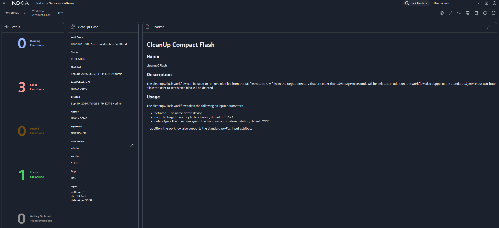
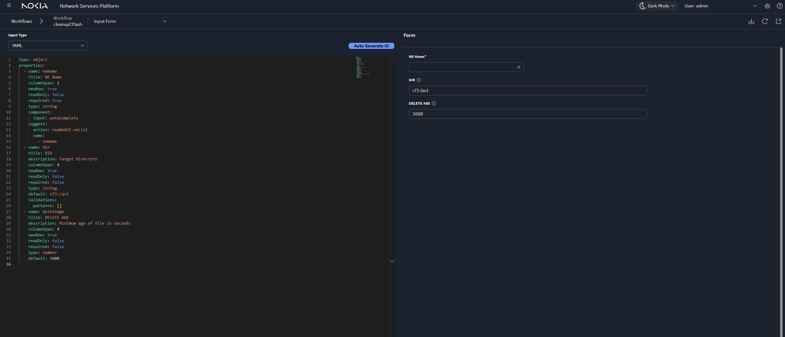
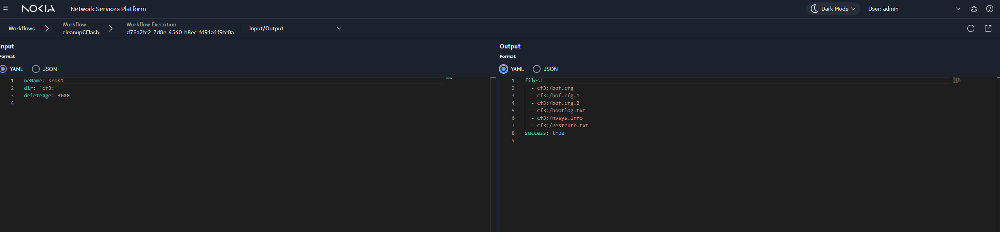
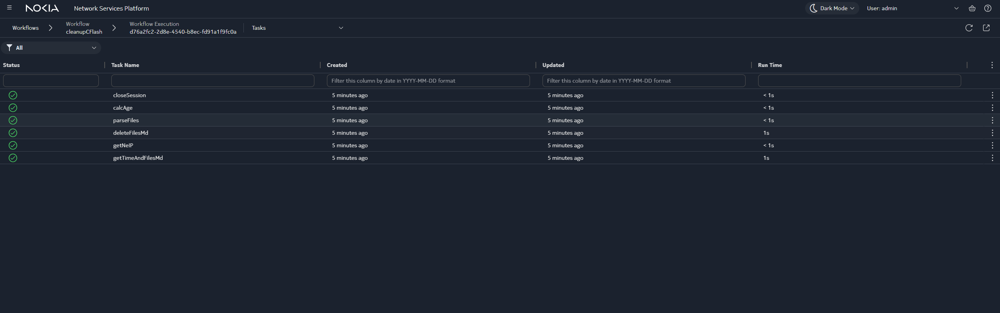

# 7x50 CF CleanUp

---

## Summary Table


| Field                     | Description                                                                                                                                     |
| ------------------------- | ----------------------------------------------------------------------------------------------------------------------------------------------- |
| **Title**                 | 7x50 CF CleanUp (`cleanupCFlash`)                                                                                                               |
| **Summary**               | A workflow that removes files older than a configurable age from an SR OS network element compact flash directory, with dry-run support.        |
| **Purpose**               | Demonstrate NE filesystem cleanup using Network Supervision lookups, managed CLI (MD and Classic), TextFSM parsing, and Python age calculation. |
| **Technologies Involved** | Mistral workflows, `nsp.https`, `nsp.managed_cli`, `nsp.textFSM`, `nsp.python`, schemaForm / Input Forms, Network Supervision REST API.         |
| **NSP Release**           | NSP 26.11                                                                                                                                       |


---


## Introduction

**Short description:** This activity walks through the `cleanupCFlash` workflow, which removes aged files from the compact flash (CF) of an NSP-managed SR OS device. The example supports both model-driven (MD) and Classic (NFM-P) management and is intended for customers, partners, and engineers learning Workflow Manager patterns for NE maintenance.

**Problem statement:** Activity or logging directories on SR OS compact flash can accumulate old files and consume space. Operators need a repeatable way to list files, skip critical system images and configs, preview deletions with `dryRun`, and run the correct MD (`file remove`) or Classic (`file delete`) commands. This example shows how to implement that in a single direct workflow.

> **Disclaimer:** This tutorial is a proof of concept and an example method for cleaning compact flash on an NSP-managed SR OS device. It is not designed to be implemented as-is in a production network. It is intended to guide development of an OSS.

---


## Pre-requisites

- **NSP:** NSP 26.11 with Workflow Manager (WFM) enabled (`workflow_meta.dependencies.platform.nspOS`).
- **Access and roles:** Developer mode enabled; Developer or Operator role to create, publish, and execute workflows.
- **External systems:** At least one SR OS NE managed in NSP (MD and/or Classic) with a target CF path such as `cf3:`.
- **Tools or skills:** Basic YAML and JSON; NSP Workflows UI or VS Code NSP workflows plugin; optional Postman or curl for WFM REST API.
- **Other:** Lab or non-production NE recommended. Do not hardcode credentials in workflow definitions.

---


## Solution Overview


### High-level design

```text
getNeIP → (MD) getTimeAndFilesMd ─┐
         → (Classic) getTimeAndFilesClassic ─┘ → parseFiles → calcAge
              → deleteFilesMd / deleteFilesClassic (if not dryRun)
              → closeSession
```

1. **getNeIP** — `nsp.https` against Network Supervision to resolve `neId`, management IP, and `sourceType` (MDM vs NFM-P). Uses a client-side `resultFilter` to limit stored data.
2. **getTimeAndFilesMd** / **getTimeAndFilesClassic** — `nsp.managed_cli` lists files in the target directory; reuses one CLI session (`sessionId`, `closeSession: false`).
3. **parseFiles** — `nsp.textFSM` extracts `NAME`, `SIZE`, and `TIMEDATE` from the directory listing.
4. **calcAge** — `nsp.python` computes file age, honours `deleteAge`, skips an `exceptList` of critical files, and builds `cmdList` for deletion.
5. **deleteFilesMd** / **deleteFilesClassic** — Runs delete commands when not in `dryRun` and candidates exist.
6. **closeSession** — Closes the managed CLI session (`closeSession: true`).



### Input


| Parameter   | Description                                          | Default    |
| ----------- | ---------------------------------------------------- | ---------- |
| `neName`    | Network element name in NSP                          | (required) |
| `dir`       | Target CF directory                                  | `cf3:` |
| `deleteAge` | Minimum file age in seconds before deletion          | `3600`     |
| `dryRun`    | WFM execution option; when true, no delete tasks run | `false`    |


**Example input:**

```json
{
  "neName": "s168_97_34_Both",
  "dir": "cf3:",
  "deleteAge": 3600
}
```


### Step-by-step guide


#### Step 1 — Create the workflow

1. Open **Workflows** in the NSP UI (or use the VS Code NSP workflows plugin).
2. Click **+ Workflow** and paste the definition from `[cleanupCFlash.yaml](./cleanupCFlash.yaml)`, or import the file.
3. Click **Validate & Update Flow**, then **Create**.

Text marked with best-practice callouts in the Network Developer Portal applies here (client-side filters, closing CLI sessions, minimising `_context` in Python). See [Workflows best practices](https://network.developer.nokia.com/learn/26_11/artifact-development/programming/workflows/wfm-workflow-development/wfm-best-practices/).

#### Step 2 — Add the workflow README in the NSP UI (optional)

From the workflow **⋮** menu, choose **View info**, open the **Readme** tab, and paste the content from `[workflow-ui-readme.md](./workflow-ui-readme.md)`.

The **Overview** screenshot above shows the published workflow info page with the Readme tab content visible in the NSP UI.

#### Step 3 — Publish the workflow

On the workflow info page, use **Modify state** to set the workflow to **Published**.

#### Step 4 — Add an Input Form (optional)

In the workflow **Input Form** section, paste the YAML from `[schema-form.yaml](./schema-form.yaml)` and update the form. The `neName` field uses `nspWebUI.neList` suggest for autocomplete.



#### Step 5 — Execute (dry-run first)

Use the UI form or the WFM REST API:

```http
POST https://<NSP_IP>/wfm/api/v1/execution
Content-Type: application/json
```

```json
{
  "workflow_id": "cleanupCFlash",
  "input": {
    "neName": "<NE_NAME>",
    "dir": "cf3:",
    "deleteAge": 3600
  },
  "params": {
    "env": "DefaultEnv",
    "options": {
      "dryRun": true,
      "force": false,
      "notifyKafka": true
    }
  },
  "output": {},
  "notifyKafka": true
}
```

**Example successful output:**

```yaml
files:
  - NAME: four.txt
    SIZE: '5'
    TIMEDATE: 10/23/2025  03:50p
  - NAME: three.txt
    SIZE: '5'
    TIMEDATE: 10/23/2025  03:01p
success: true
```

After execution, review **Input/Output** on the workflow execution page. A successful run lists candidate paths (or files identified for deletion when not in dry-run) and sets `success` to true:



On the execution **Tasks** tab, confirm each task completed (for example `getNeIP`, `getTimeAndFilesMd`, `parseFiles`, `calcAge`, `deleteFilesMd`, and `closeSession`):



### Code walkthrough


| Task                       | Action            | Notes                                                                  |
| -------------------------- | ----------------- | ---------------------------------------------------------------------- |
| **getNeIP**                | `nsp.https`       | Starting point; branches on `sourceType` to MD or Classic path.        |
| **getTimeAndFilesMd**      | `nsp.managed_cli` | `file list` on MD; persists `sessionId`.                               |
| **getTimeAndFilesClassic** | `nsp.managed_cli` | `file dir` on Classic; persists `sessionId`.                           |
| **parseFiles**             | `nsp.textFSM`     | Parses directory listing into structured rows.                         |
| **calcAge**                | `nsp.python`      | Age check, exception list, builds `cmdList`; passes minimal `context`. |
| **deleteFilesMd**          | `nsp.managed_cli` | `file remove … force` on MD.                                           |
| **deleteFilesClassic**     | `nsp.managed_cli` | Translates commands to `file delete` for Classic.                      |
| **closeSession**           | `nsp.managed_cli` | `exit all` and `closeSession: true`.                                   |


Critical filenames in the Python `exceptList` (for example `BOF.CFG`, `CONFIG.CFG`, `NVRAM.DAT`, and selected TIM/boot images) are never deleted. Review and extend this list before any non–dry-run use on real hardware.

---


## Conclusion

You now have a workflow that cleans aged files from SR OS compact flash with MD and Classic paths, dry-run preview, and an optional schemaForm Input Form. Workflows can simplify complex NE maintenance tasks; Input Forms help integrate execution into the NSP UI with validated inputs.

---


## References

- [NSP Workflow description](https://documentation.nokia.com/nsp/26-11/Network_Automation/wf_desc.html)
- [Workflows best practices](https://network.developer.nokia.com/learn/26_11/artifact-development/programming/workflows/wfm-workflow-development/wfm-best-practices/)
- [Development best practices](https://network.developer.nokia.com/learn/26_11/artifact-development/programming/development-best-practices/)
- [Nokia Network Developer Portal – NSP](https://network.developer.nokia.com/)
- Workflow definition: `[cleanupCFlash.yaml](./cleanupCFlash.yaml)`
- [Community guidelines](../../GUIDELINES.md)
- [README template](../../template/Contribution_template.md)

---


## Security and operations

- Run with `dryRun: true` first and validate output against the NE.
- Confirm `dir` and `deleteAge` for your environment; adjust `exceptList` in `calcAge` as needed.
- Do not commit credentials or environment-specific secrets into this repository.
- Not intended for production use without review and hardening.

---


## Troubleshooting


| Symptom               | Possible cause                                  | Suggestion                                                                |
| --------------------- | ----------------------------------------------- | ------------------------------------------------------------------------- |
| No files in output    | Directory empty or TextFSM template mismatch    | Verify CLI output format on the NE; adjust TextFSM template.              |
| Workflow skips delete | `dryRun` is true or no files exceed `deleteAge` | Check execution options and timestamps on the NE.                         |
| CLI errors on delete  | Wrong MD vs Classic path                        | Confirm `sourceType` from Network Supervision and branch tasks.           |
| Session errors        | Session not closed on prior failure             | Re-run; ensure `closeSession` runs (including `on-error` from `calcAge`). |


