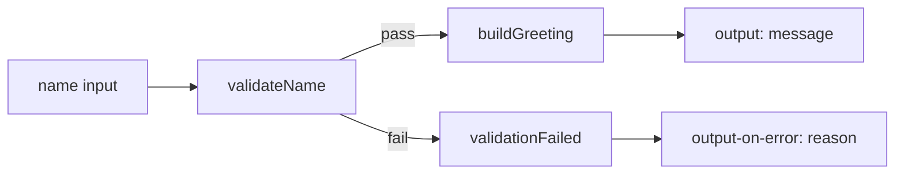

# Hello World — your first NSP Workflow Manager workflow

## Summary Table

| Field                     | Description                                                                                                                                 |
| ------------------------- | ------------------------------------------------------------------------------------------------------------------------------------------- |
| **Title**                 | Hello World — your first NSP Workflow Manager workflow                                                                                      |
| **Summary**               | A minimal direct Mistral workflow that validates a `name` input, builds a greeting with `nsp.python`, and returns structured `output` / `output-on-error`. |
| **Purpose**               | Introduce new NSP WFM users to workflow structure, inputs, tasks, publishing, transitions, and best practices before tackling inventory, CLI, or API-heavy automations. |
| **Technologies Involved** | Mistral workflows (`version: '2.0'`), `nsp.assert`, `nsp.python`, YAQL expressions, YAML.                                                   |
| **NSP Release**           | Validated for **NSP 26.4** (`workflow_meta.dependencies.platform.nspOS`). Core actions (`nsp.python`, `nsp.assert`) are available from NSP 20.9+. |

---

## Introduction

This activity is the recommended **first workflow** for anyone new to Nokia NSP Workflow Manager (WFM). You import a short YAML definition, publish it, run it from the WFM UI with a single input (`name`), and inspect the execution output. Along the way you learn the building blocks every larger automation reuses: workflow metadata, inputs, tasks, `publish`, `on-success` / `on-error` transitions, and explicit success and failure outputs.

**Problem statement:** Before automating inventory queries, device CLI, or REST integrations, you need to understand how Mistral DSL v2 workflows are structured and executed inside NSP. A Hello World workflow answers that question without external dependencies: it validates a parameter early, formats a message, and returns a clear result — patterns you will apply in every production workflow.

---

## Pre-requisites

- **NSP:** Workflow engine (WFM) enabled on your cluster or lab.
- **Access and roles:** Rights to import workflow definitions, publish workflows, and start executions (typically Developer or Operator role with workflow WRITE and EXECUTE access).
- **External systems:** None — this workflow does not call REST APIs, devices, or file services.
- **Tools or skills:** Basic YAML indentation; familiarity with the NSP UI **Workflows** section.
- **Other:** No in-cluster service URLs or credentials are required for this example.

---

## Solution Overview

### High-level design

The workflow `hello-world` is a **direct** workflow with three tasks:

1. **`validateName`** — Uses `nsp.assert` to ensure the `name` input is non-empty **before** any greeting logic runs. On success, publishes `validatedName` and continues to `buildGreeting`. On failure, publishes `validationError` and routes to `validationFailed`.
2. **`validationFailed`** — Shared error exit (`join: 0`) that calls `std.fail` with a human-readable message. The workflow-level `output-on-error` surfaces `reason` to the caller.
3. **`buildGreeting`** — Uses `nsp.python` with an explicit `context` list (not the `$` context) to format `"Hello, {name}! Welcome to NSP Workflow Manager."` and publishes `greeting`.

**Data flow:** `name` (input) → `validatedName` → `greeting` → workflow `output`. On validation failure: `validationError` → `output-on-error`.



| Symbol / input    | Role                                                                |
| ----------------- | ------------------------------------------------------------------- |
| `name`            | Workflow input; who to greet. Default: `World`.                     |
| `validatedName`   | Published by `validateName` after the assert passes.                |
| `greeting`        | Final message string from `buildGreeting`.                          |
| `validationError` | Published on assert failure; returned via `output-on-error.reason`. |
| `output.status`   | `success` on completion; `failed` when validation fails.            |
| `output.message`  | The greeting text on success.                                       |

The complete workflow definition is in [`hello-world.yaml`](./hello-world.yaml).

### Step 1 — Review the workflow definition

Open [`hello-world.yaml`](./hello-world.yaml) in this folder. The top-level workflow key is `hello-world` and the file declares `version: '2.0'` with `type: direct`.

The workflow shell every WFM workflow shares:

```yaml
version: '2.0'

hello-world:
  description: Your first NSP Workflow Manager workflow — greet a user by name
  type: direct

  tags:
    - Getting Started
    - WFM Demo

  workflow_meta:
    author: NSP WFM Tutorial
    version: '1.0.0'
```

- `version: '2.0'` selects **Mistral DSL v2** syntax.
- The key `hello-world` is the **workflow name** WFM registers (RFC 1123 label: lowercase, hyphens allowed).
- `type: direct` means tasks run in a forward graph.
- `tags` help you filter workflows in the UI; `workflow_meta` documents authorship and platform dependencies.

### Step 2 — Understand inputs and outputs

The workflow accepts one input and declares explicit success and failure payloads:

```yaml
  input:
    - name: World

  output:
    status: success
    message: <% $.greeting %>
    name: <% $.validatedName %>

  output-on-error:
    status: failed
    reason: <% $.validationError %>
```

Using `output` and `output-on-error` lets operators read a structured result from the execution record without inspecting every task. Expressions like `<% $.greeting %>` are **YAQL** embedded in YAML — they read workflow variables at runtime.

### Step 3 — Validate parameters early

The entry task `validateName` uses `nsp.assert` to fail fast when `name` is empty:

```yaml
    validateName:
      description: Reject empty name input before building the greeting
      action: nsp.assert
      input:
        input: <% $.name.len() %>
        expected: 0
        shouldFail: true
      publish:
        validatedName: <% $.name %>
      publish-on-error:
        validationError: "Input 'name' must be a non-empty string."
      on-success:
        - buildGreeting
      on-error:
        - validationFailed
```

Checking workflow parameters **first** is a core WFM best practice — avoid starting work only to discover an input was wrong midway through a longer automation. Prefer `nsp.assert` with `on-error` routing for validation; reserve `std.fail` for the terminal error handler.

### Step 4 — Build the greeting with Python

```yaml
    buildGreeting:
      description: Build the Hello World message with nsp.python
      action: nsp.python
      input:
        context: <% [$.validatedName] %>
        script: |
          def greet(name):
              return "Hello, {}! Welcome to NSP Workflow Manager.".format(name)
          return greet(context[0])
      publish:
        greeting: <% task().result %>
```

Pass only the data the script needs via `context` — do **not** use the `$` context, which can expose credentials. Use `nsp.python` instead of `std.Javascript` for better resource efficiency.

### Step 5 — Wire the error handler

```yaml
    validationFailed:
      join: 0
      action: std.fail
      input:
        error_data: <% $.validationError %>
```

`join: 0` keeps the flow diagram compact when a task may be reached from multiple branches; it does not change execution semantics.

### Step 6 — Import and publish the workflow

1. In the NSP WebUI, open **Workflow Manager** → **Workflows**.
2. Click **Import Workflow from File** and select [`hello-world.yaml`](./hello-world.yaml).
3. Confirm the workflow list shows **hello-world** with tags `Getting Started` and `WFM Demo`.
4. The imported workflow is in **DRAFT** state. From the workflow row menu (three dots), choose **Modify Status**, set the state to **PUBLISHED**, and click **UPDATE**.

> **DRAFT vs PUBLISHED:** Only **PUBLISHED** workflows can be executed. Operators continue to run the last published version even if a developer edits a draft copy.

### Step 7 — Run and inspect results

1. Start a new execution of **hello-world**.
2. **Happy path:** leave `name` at the default `World` (or set `name` to your own value, e.g. `NSP`).
3. When the execution completes, open **Quick View → Input/Output**. You should see:

```yaml
status: success
message: "Hello, World! Welcome to NSP Workflow Manager."
name: World
```

4. **Validation path:** start another execution with `name` set to an **empty string** `""`.
5. The execution should fail; `output-on-error` should report:

```yaml
status: failed
reason: "Input 'name' must be a non-empty string."
```

Use **Quick View → FLOW** to see task order: `validateName` → `buildGreeting` on success, or `validateName` → `validationFailed` on empty input.

---

## Conclusion

You should now be able to read a Mistral v2 workflow YAML, import it into NSP WFM, publish it, run it with inputs, and interpret `output` versus `output-on-error`. The **hello-world** workflow stays small while demonstrating validation-first design, `nsp.python`, structured outputs, and error routing — the same patterns used in production automations.

**Suggested next steps:**

- Read [WFM best practices](https://network.developer.nokia.com/learn/26_4/artifact-development/programming/workflows/wfm-workflow-development/wfm-best-practices/) on the Nokia Network Developer Portal.
- Explore additional workflow examples in the [Nokia NSP workflow repository on GitHub](https://github.com/nokia/nsp-workflow).
- Try reachability checks with the `nsp.ping` action as a follow-up exercise.

---

## References

- [Nokia Network Developer Portal](https://network.developer.nokia.com/) — official NSP developer documentation and APIs.
- [NSP Workflow description (NSP 25.8)](https://documentation.nokia.com/nsp/25-8/Network_Automation/wf_desc.html) — Mistral workflow language overview.
- [WFM workflow development](https://network.developer.nokia.com/learn/26_4/artifact-development/programming/workflows/wfm-workflow-development/) — workflow concepts, lifecycle, and RBAC.
- [WFM best practices](https://network.developer.nokia.com/learn/26_4/artifact-development/programming/workflows/wfm-workflow-development/wfm-best-practices/) — validation, output shaping, and Python context guidance.
- [WFM actions and functions](https://network.developer.nokia.com/learn/26_4/artifact-development/programming/workflows/wfm-workflow-development/wfm-workflow-actions/) — `nsp.assert`, `nsp.python`, and other built-in actions.
- [Mistral DSL v2 specification](https://docs.openstack.org/mistral/latest/user/wf_lang_v2.html)
- [Nokia NSP workflow repository on GitHub](https://github.com/nokia/nsp-workflow) — additional sample workflows by NSP release.
- Workflow definition: [`hello-world.yaml`](./hello-world.yaml)

---

## Troubleshooting

| Symptom | Likely cause | What to do |
| ------- | ------------ | ---------- |
| Cannot execute workflow | Workflow is still in **DRAFT** | Modify status to **PUBLISHED**. |
| Import fails on workflow name | Invalid name format | Name must be RFC 1123 (lowercase, hyphens); key is `hello-world`. |
| `nsp.assert` / `nsp.python` missing | Platform version below NSP 20.9 | Upgrade or use actions available in your release. |
| Empty `name` does not fail | Wrong input value | Confirm you passed `""` not whitespace-only. |
| Output fields show unevaluated YAQL | Execution incomplete or missing publish | Wait for completion; confirm `buildGreeting` published `greeting`. |

---

## Security and operations

- This example does not store credentials or call external services.
- Avoid hardcoding IP addresses or passwords in workflows; use input parameters, environment references, or NSP password management for production designs.
- Do not pass the full workflow context (`$`) to scripts or actions; expose only the variables you need via `context`.
