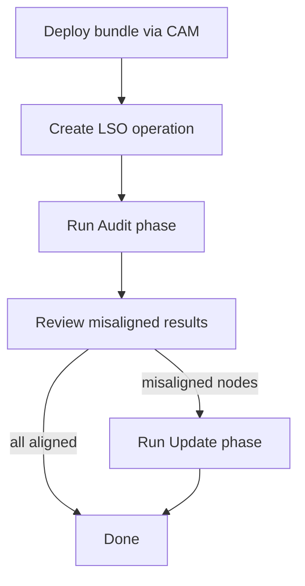
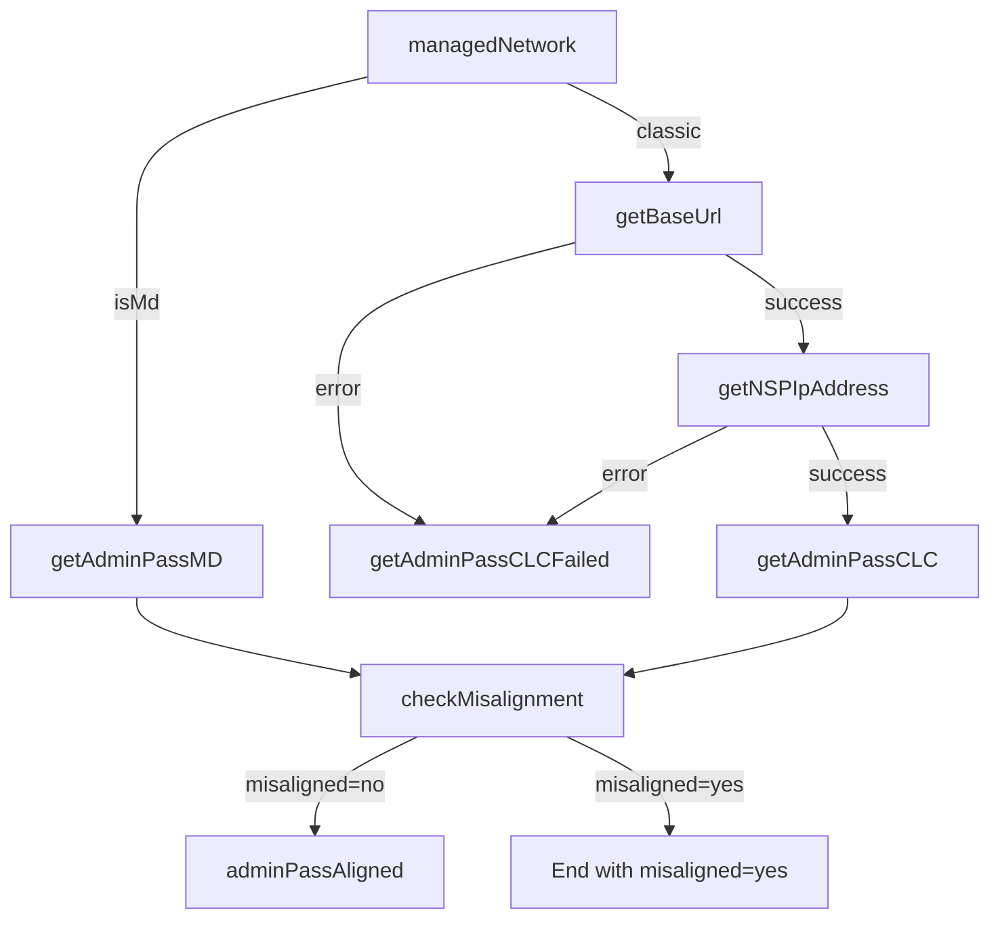
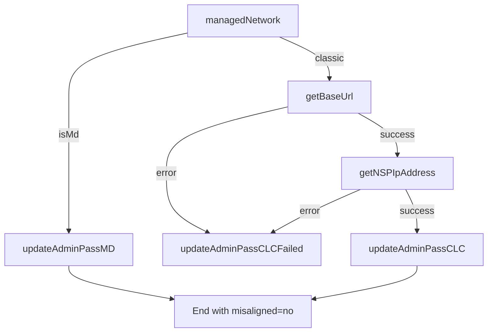
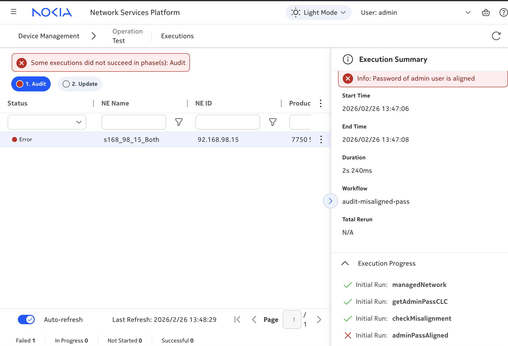
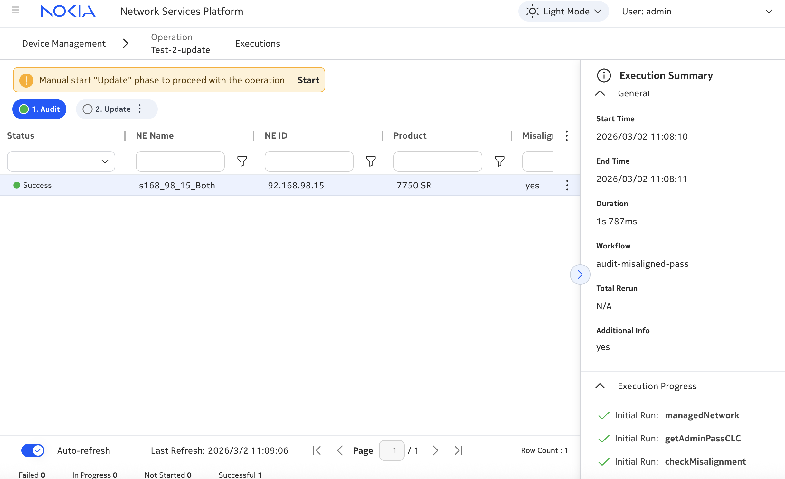
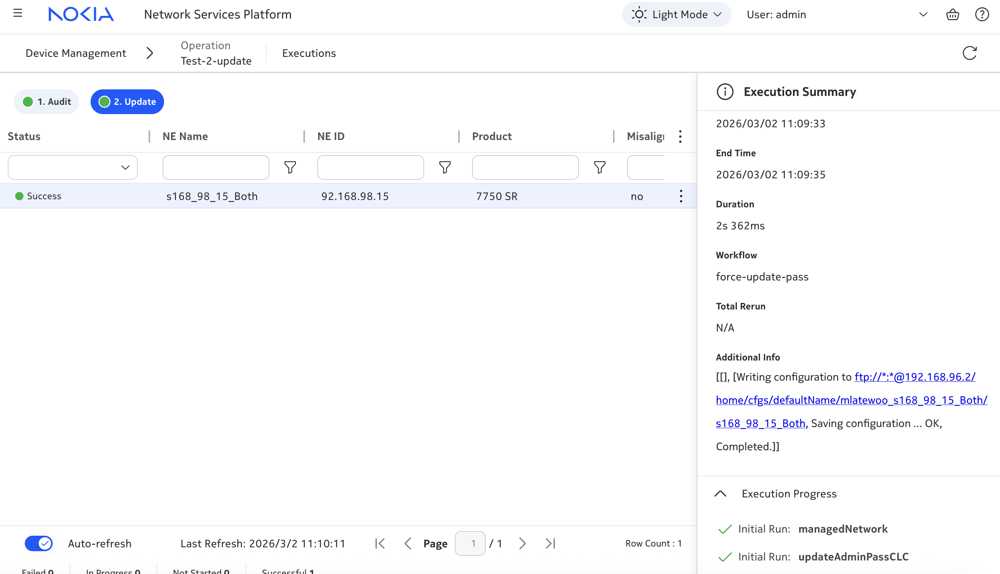

# NE Password Audit: Audit and Force-Update Admin Password via LSO

---

## Summary Table

| Field                     | Description                                                                                                                                                                                                 |
| ------------------------- | ----------------------------------------------------------------------------------------------------------------------------------------------------------------------------------------------------------- |
| **Title**                 | NE Password Audit — LSO operation to audit and force-update admin passwords                                                                                                                                 |
| **Summary**               | A signed LSO artifact bundle with two phases: **Audit** checks whether each target NE's admin password matches an intended value, and **Update** writes the intended password on misaligned nodes. Supports model-driven and classic NEs. |
| **Purpose**               | Show how to deploy and run a custom LSO operation for repeatable password compliance across many network elements, using Operation Manager for target selection, phased execution, and result review.       |
| **Technologies Involved** | LSO artifact bundle, NSP Operation Manager, Workflow Manager, RESTCONF, NFMP v3 CLI, YANG augmentation, `nsp.https`, `nsp.python`, bcrypt.                                                                 |
| **NSP Release**           | Validated for **NSP 25.4+**                                                                                                                                    |

---

## Introduction

**Short description:** This activity explains how to deploy and use the `ne-password-audit` LSO operation. You select target network elements in NSP Operation Manager, run an **Audit** phase to detect password misalignment, review the results, and optionally run an **Update** phase to correct passwords on affected nodes.

**Problem statement:** When admin passwords on managed NEs drift from intended credentials, manual checks do not scale. Operations teams need a repeatable, phased approach: audit many targets in parallel, review which nodes are misaligned, then update only those that need correction. This example ships as a ready-to-deploy signed artifact bundle — you do not need to build the workflows yourself.

**Disclaimer:** This is a **proof-of-concept community example**. It is not designed for production use as-is. Validate thoroughly, harden credential handling, and tune concurrency before using in live networks.

---

## Pre-requisites

- **NSP:** NSP 25.4 or later with **Large Scale Operations** and **Workflow Manager** enabled.
- **Signed bundle:** The distributed zip includes `signature.txt`. Do not re-zip or edit bundle contents — signature validation will fail. Use the provided [`ne-password-audit-bundle.zip`](./ne-password-audit-bundle.zip) as-is.
- **Access and roles:** Rights to deploy artifact bundles via CAM (Configuration and Administration Module), create and run LSO operations, and access target NEs (per deployment RBAC).
- **External systems:** Target NEs (7750 SR, 7950 XRS, 7450 ESS, 7250 IXR) managed by NSP in model-driven or classic mode; the audit `username` must exist as a local user on each target.
- **Tools or skills:** Familiarity with NSP Operation Manager UI; optional: RESTCONF client or curl for API-based operation creation.

---

## Solution Overview

### High-level design

The example packages an LSO operation type with two execution phases:

| Phase | Workflow | What it does |
| ----- | -------- | ------------ |
| **Audit** | `ne-password-audit` | Reads the admin password hash on each target NE and compares it with the intended password using bcrypt. Sets `misaligned` to `"yes"` or `"no"`. Does not change the device. |
| **Update** | `ne-password-update` | Writes the intended password to each target NE (RESTCONF YANG PATCH on model-driven NEs, NFMP v3 CLI on classic NEs). |

NSP components involved:

- **Operation Manager (LSO)** — Registers the operation type, manages targets and phases, and presents execution results.
- **Workflow Manager** — Runs the Audit and Update workflows behind each phase.
- **Artifact bundle** — Delivers the operation definition, YANG model, phase profile, and workflow YAMLs via CAM.



For each target NE, the bundled workflows look up the NE in inventory, branch on model-driven vs classic management, then either read and compare (Audit) or write (Update) the admin password. Execution state exposes `misaligned` and `lsoInfo` per target in Operation Manager.

### Artifact bundle contents

Download [`ne-password-audit-bundle.zip`](./ne-password-audit-bundle.zip). The zip contains:

```
ne-password-audit-bundle/
├── metadata.json
├── signature.txt
├── operation-types/
│   ├── operation_types.json
│   ├── ne-password-audit.yaml
│   └── ne-password-audit.yang
└── workflows/
    ├── ne-password-audit.yaml
    ├── ne-password-update.yaml
    └── README.md
```

| Path in zip | Role |
| ----------- | ---- |
| `metadata.json` | Bundle descriptor for CAM deployment. |
| `signature.txt` | Bundle signature — do not modify the zip after signing. |
| `operation-types/operation_types.json` | Registers operation type `ne-password-audit`. |
| `operation-types/ne-password-audit.yaml` | Phase profile: Audit and Update phases, concurrency 20, phase timeout 15 s. |
| `operation-types/ne-password-audit.yang` | Operation inputs (`username`, `password`) and execution output (`misaligned`). |
| `workflows/ne-password-audit.yaml` | Audit phase workflow. |
| `workflows/ne-password-update.yaml` | Update phase workflow. |

### Operation inputs and results

| Input / output | Description |
| -------------- | ----------- |
| `username` | Local admin username to audit or update (e.g. `admin`). Set when creating the operation. |
| `password` | Intended admin password. Set when creating the operation. |
| `misaligned` | Per-target result: `"yes"` if the password does not match, `"no"` if it matches or was updated successfully. |
| `lsoInfo` | Human-readable message or error for each target execution. |

LSO passes three inputs to each workflow per target: `neId`, `username`, and `password`. Both workflows publish `lsoInfo` and `misaligned` as outputs.

---

### Workflow task reference

Full workflow source is inside the signed bundle. The sections below describe each task so you can understand the logic without importing separate YAML files.

#### Audit workflow (`ne-password-audit`)



| Task | Action | What it does |
| ---- | ------ | ------------ |
| **`managedNetwork`** | `nsp.https` | POSTs to `nsp-inventory:find` for the target `neId`. Uses `fields` and `include-meta` to return a compact row and derives `isMd` (model-driven vs classic) from inventory metadata. Publishes `neInfo`. Branches to the MD or classic password-read path. |
| **`getBaseUrl`** | `nsp.https` | Classic path only. GETs the SAM-O server location from `rest-gateway` to obtain the effective NFMP base URL. Retries up to 10 times with a 5 s delay. On failure, routes to `getAdminPassCLCFailed`. |
| **`getNSPIpAddress`** | `std.js` | Classic path only. Parses the host name from `baseUrl` (strips port) and publishes `nfmp_host` for NFMP v3 requests. |
| **`getAdminPassCLCFailed`** | `std.fail` | Failure handler when `getBaseUrl` or `getNSPIpAddress` fails. Sets `lsoInfo` to an NFMP host resolution error and ends the workflow. |
| **`getAdminPassMD`** | `nsp.https` | Model-driven path. GETs the current password hash for `username` via MDM RESTCONF. Uses `resultFilter` to extract only the hash. Publishes `nePass`. |
| **`getAdminPassCLC`** | `nsp.https` | Classic path. POSTs to NFMP v3 `executeMultiCli` with `info \| match password` for the user. Parses the bcrypt hash from CLI output and publishes `nePass`. |
| **`checkMisalignment`** | `nsp.python` | Compares the intended `password` with the device hash `nePass` using `bcrypt.checkpw`. Publishes `misaligned` as `"yes"` or `"no"`. |
| **`adminPassAligned`** | `std.fail` | Runs only when `misaligned` is `"no"`. Ends the workflow with an informational message in `lsoInfo` (`"Info: Password of … user is aligned"`). Operation Manager displays this as the aligned-password result. |

When the password is **not** aligned, `checkMisalignment` publishes `misaligned: "yes"` and the workflow ends without calling `adminPassAligned`. No device configuration is changed.

**Practice note — inventory lookup:** The `managedNetwork` task uses a targeted xpath-filter, `fields`, and a `resultFilter` to keep the payload small. This follows [server-side filtering](https://network.developer.nokia.com/learn/26_4/artifact-development/programming/workflows/wfm-workflow-development/wfm-best-practices/#server-side-filters) guidance.

```yaml
    managedNetwork:
      action: nsp.https
      input:
        method: POST
        url: https://restconf-gateway/restconf/operations/nsp-inventory:find
        body:
          input:
            xpath-filter: /nsp-equipment:network/network-element[ne-id = "<% $.neId %>"]
            fields: ne-id;ne-name;ip-address
            include-meta: true
            depth: 2
        resultFilter: >-
          $.content.get("nsp-inventory:output").data.select({ ... }).first()
```

**Practice note — bcrypt comparison:** Password verification uses `nsp.python` with `bcrypt`, which is preferred over JavaScript for this type of logic.

```yaml
    checkMisalignment:
      action: nsp.python
      input:
        context: <% [$.password, $.nePass] %>
        script: |
          import bcrypt
          if bcrypt.checkpw(context[0].encode("utf-8"), context[1].encode("utf-8")):
            return "no"
          else:
            return "yes"
```

---

#### Update workflow (`ne-password-update`)



| Task | Action | What it does |
| ---- | ------ | ------------ |
| **`managedNetwork`** | `nsp.https` | Same inventory lookup and MD/classic branch as Audit. Publishes `neInfo` and routes to the appropriate update path. |
| **`getBaseUrl`** | `nsp.https` | Classic path only. Resolves the SAM-O/NFMP base URL (same logic as Audit). |
| **`getNSPIpAddress`** | `std.js` | Classic path only. Extracts `nfmp_host` from `baseUrl`. |
| **`updateAdminPassCLCFailed`** | `std.fail` | Failure handler when NFMP host resolution fails on the Update path. |
| **`updateAdminPassMD`** | `nsp.https` | Model-driven path. PATCHes the user password via RESTCONF YANG patch (`ietf-yang-patch`). Sets `misaligned` to `"no"` on success. |
| **`updateAdminPassCLC`** | `nsp.https` | Classic path. POSTs to NFMP v3 `executeMultiCli` to set the password and run `admin save`. Sets `misaligned` to `"no"` on success. |

The Update workflow does not run a bcrypt comparison — it writes the intended password directly. Default `misaligned` is `"yes"` until a successful update sets it to `"no"`.

`managedNetwork`, `getBaseUrl`, and `getNSPIpAddress` are duplicated in both workflows so each phase remains self-contained and deployable independently.

---

### Step-by-step guide

#### Step 1 — Deploy the artifact bundle

**Goal:** Load the operation type and workflows into NSP.

**What to do:**

1. Download [`ne-password-audit-bundle.zip`](./ne-password-audit-bundle.zip).
2. In NSP **Configuration and Administration Module (CAM)** → **Artifact Management**, import and deploy the bundle.
3. Verify after deployment:
   - Operation type `ne-password-audit` appears in Operation Manager.
   - Workflows `ne-password-audit` and `ne-password-update` are loaded in Workflow Manager.

**Practice note — signed bundle:** This zip includes `signature.txt`. Do not unzip, edit, and re-zip the contents — CAM signature validation will fail. If import fails with a signature error, re-download the bundle from this repository and confirm you are using the unmodified file.

---

#### Step 2 — Create and run the operation (GUI)

**Goal:** Audit admin passwords on selected NEs and review the results.

**What to do:**

1. Navigate to **Device Management** → **All operations**.
2. Click **+OPERATION** (top right).
3. Select operation type: `ne-password-audit`.
4. Enter `username` and `password` (the intended admin credentials).
5. Select one or more target NEs from inventory.
6. Click **Create** to start the Execute phase (runs immediately by default).
7. Monitor execution in the task tracker. Review `misaligned` and `lsoInfo` for each target.
8. If any targets show `misaligned: yes`, run the **Update** phase when you are ready to correct them.

**Execution results:**

When the password is **aligned**, the Audit phase reports an informational message:



When the password is **not aligned**, the Audit phase completes successfully and waits for you to run the Update phase:



After running the Update phase:



---

#### Step 3 — Create and run the operation (RESTCONF API)

**Goal:** Create an LSO operation programmatically.

**What to do:** POST to the LSO operations endpoint:

```json
POST https://<NSP_IP>/restconf/data/nsp-lso-operation:lso-operations
Content-Type: application/json

{
  "operation": [
    {
      "name": "ne-password-audit-demo",
      "description": "Audit NE admin password",
      "operation-type": "ne-password-audit",
      "target": [
        "fdn:model:equipment:NetworkElement:1056245"
      ],
      "phase": [
        {
          "name": "Execute",
          "execution-mode": "immediate"
        }
      ],
      "ne-password-audit-operation": {
        "username": "admin",
        "password": "<intended-password>"
      }
    }
  ]
}
```

**Note:** As of NSP 25.4, targets can also be specified as `neId` values (IP addresses) in addition to FDN-formatted identifiers.

---

#### Step 4 — Run the Update phase

**Goal:** Correct passwords on misaligned NEs.

**What to do:** After reviewing Audit results, trigger the **Update** phase from Operation Manager for the same operation instance. The Update phase runs the `ne-password-update` workflow on the selected targets and sets `misaligned` to `"no"` on success.

**Practice note:** Run Audit first and review results before executing Update. The Update phase changes live device credentials.

---

## Troubleshooting

| Symptom | Things to check |
| ------- | --------------- |
| Operation type not found after deploy | Confirm bundle deployment succeeded in CAM; verify name is `ne-password-audit`. |
| Signature verification failed on import | Re-download [`ne-password-audit-bundle.zip`](./ne-password-audit-bundle.zip) — do not modify or re-zip the bundle. |
| Audit fails for classic NEs | NFMP/SAM-O connectivity; confirm NE is reachable and `username` exists on the device. |
| Audit fails for model-driven NEs | MDM RESTCONF access; confirm `username` is configured on the NE. |
| `bcrypt` or workflow execution error | Workflow Manager Python environment; contact your NSP administrator. |
| Aligned password shows as failed in UI | Expected behavior — the Audit workflow uses an informational end state when the password already matches. |
| Update phase not available | Confirm Audit phase completed; check operation instance state in Operation Manager. |

---

## Security and operations

- **Sensitive inputs:** `password` is stored in the LSO operation and workflow execution context. Treat operation inputs as sensitive and restrict RBAC accordingly. See [WFM password management](https://network.developer.nokia.com/learn/26_4/artifact-development/programming/workflows/wfm-workflow-development/wfm-password-management.html).
- **Update phase impact:** The Update phase changes live device credentials. Use Audit results to confirm scope before running Update on production targets.
- **Concurrency:** The phase profile defaults to concurrency 20. Tune based on your environment capacity before large-scale runs.

---

## Conclusion

You should now be able to deploy the `ne-password-audit` artifact bundle, run the Audit phase to check password alignment across target NEs, review results in Operation Manager, and run the Update phase to correct misaligned passwords. The bundled workflow YAML inside the zip is available for study if you need to adapt the logic for your environment.

For a reporting-oriented variant that audits all NEs and produces an HTML report, see the **Password Audit Report** example in the [nsp-automation](https://github.com/nokia/nsp-automation) repository.

---

## References

- [Nokia Network Developer Portal](https://network.developer.nokia.com/) — NSP APIs and programming artifacts.
- [Workflow](https://network.developer.nokia.com/learn/26_4/artifact-development/programming/workflows/) — NSP workflow development and programming guidance.
- [Large Scale Operation](https://network.developer.nokia.com/learn/26_4/API-reference/network-functions/device-management/lsom-framework-apis/) — LSO framework APIs and Operation Manager.
- [nsp-automation GUIDELINES](https://github.com/nokia/nsp-automation/blob/main/GUIDELINES.md) — contribution and documentation standards.
- Artifact bundle: [`ne-password-audit-bundle.zip`](./ne-password-audit-bundle.zip)
