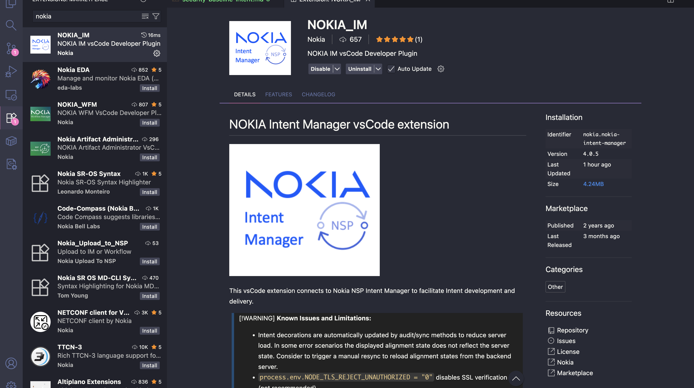
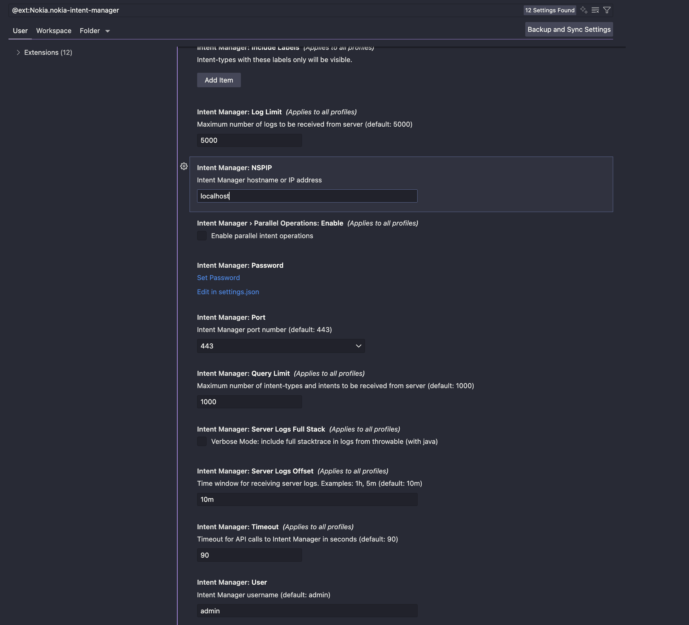
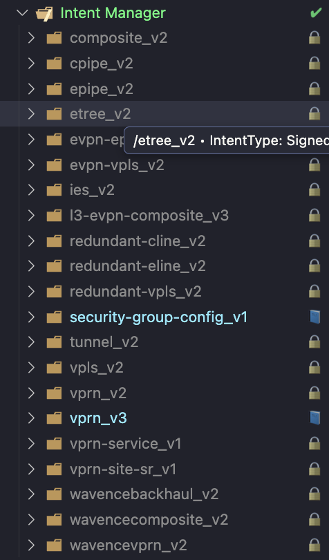
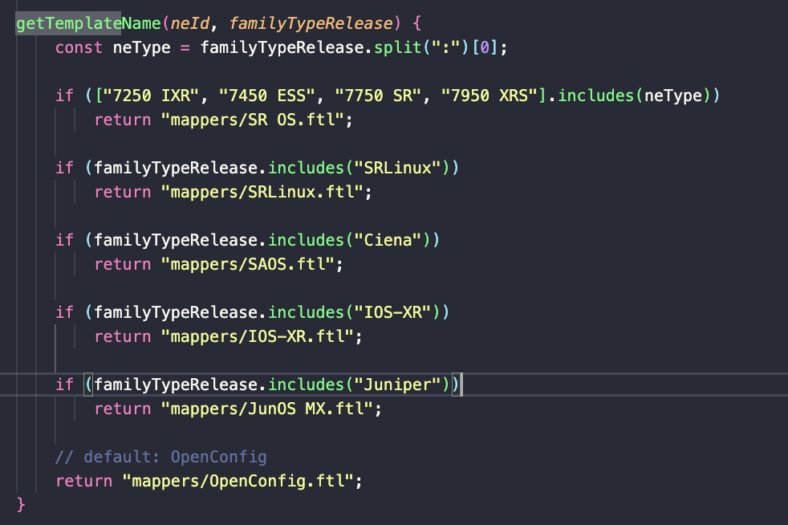
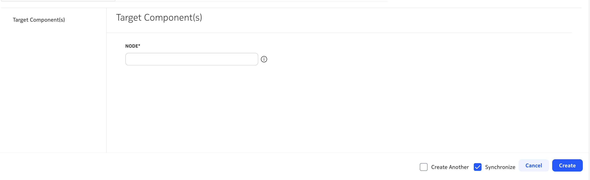

# Security Baseline Configuration

## Prerequisites

This tutorial requires basic knowledge about the following areas:

* Basic knowledge the NSP UI
* Intermediate knowledge about NSP Intent Manager
* Intermediate knowledge about Nokia SROS CLI navigation
* Basic knowledge of the Nokia IM vs code extension  

## Disclaimer

This tutorial is meant as a proof of concept and should only be used for demo purposes or training

## Restrictions

* Nodes with NETCONF/gRPC support only
* Pickers/suggest for nodes and ports (from inventory) are limited to a maximum of 1000 entries

## Release

This tutorial has been tested with and is supported in NSP 25.11

## Overview

Security baselines are only effective if they are applied consistently across all devices — and kept that way over time. In practice, differences between platforms and configuration drift often result in small gaps that can quickly become security holes. Manually tracking these differences is error-prone, and updating each device configuration one by one is not sustainable. This tutorial is meant to serve as a custom intent creation exercise to track all security policies of your managed nodes in your NSP instance. By defining an abstract intent-type for node-level security, users can express what should be enforced while NSP ensures how this is realized across different router families and network operating systems. The result is a scalable way to maintain conformance and avoid drift, with one high-level intent applied network wide.

## Installation NOKIA_IM extension on Visual Studio Code

* Launch Visual Studio Code
* Navigate to extensions, search for **NOKIA_IM** and **Click** install, wait for the installation to complete



* Once installed, **Click** the gear icon and **Click** settings
* **Fill out Intent Manager:NSPIP** with your current NSP instance IP
* **Click** Set Password and enter password of the NSP instance
* **Change Intent Manager:username** if required this username is used to login to your NSP instance



## Create Intent Type

If successfully installed users will be able to see all intents present on their NSP instance



There are just a few more steps before the intent is created, which are the following:

1. Right **Click** directly on the root level of the intent manager, a menu should appear with an option to **Create intent-type** click this option
2. Enter the name of the intent type, preferably **security-config-group**
3. Enter author name
4. It will prompt to select *template* click **SRX deviceSecurity SReXperts | device security**

Users are not recommended to modify any static js file, we are strictly concentrated on the directory of *intent-type-resources/mappers*, from there there is an exisiting example of a golden configuration **SR OS.ftl** file

This file may be modified with users own golden configuration

```yaml
Use CLI commands pwc model-path and info json to get the snippets to be added to the SROS.ftl template. it is also recommended that users use md-cli 
```

> ![NOTE]
>
> if the node type is not SROS some commands will be different
>
> the equivalent of info json (SROS) for SR Linux is info | as json
>
### What file name to create for golden configuration under intent-type-resources/mappers



| Node Type | File Name |
| --- | --- |
| SROS  7250 IZR 7450 ESS 7750 SR 7950 XRS | SR_OS.ftl |
| SRLinux | SR_OS.ftl |
| Ciena | SAOS.ftl |
| IOS-XR | IOS-XR.ftl |
| Juniper | JunOS_MX.ftl |  

### Skeleton entry needed to be added in SR_OS.ftl

```yaml
"descriptive name for the entry i.e. 'disable insecure protocols (ftp, telnet) under system security": {
        "config": {
            "target": "this value is retrived from the node by doing 'pwc model-path'  for the configuration",
            "operation": [REPLACE|MERGE],
            "value": "this value is retrived from the node by doing 'info json' on the configuration"
            }
        }
    }
```

### Example of entry in SR_OS.ftl

This is a following golden configuration for SR OS

```yaml
<#setting number_format="computer">
{
    "disable insecure protocols (ftp, telnet) under system security": {
        "config": {
            "target": "nokia-conf:/configure/system/security",
            "operation": "merge",
            "value": {
                "nokia-conf:security": {
                    "telnet-server": false,
                    "telnet6-server": false,
                    "ftp-server": false
                }
            }
        }
    },
    "management-access-filter": {
        "config": {
            "target": "nokia-conf:/configure/system/security/management-access-filter",
            "operation": "replace",
            "value": {
                "nokia-conf:management-access-filter": {
                    "ip-filter": {
                        "admin-state": "enable",
                        "default-action": "accept",
                        "entry": [
                            {
                                "entry-id": 10,
                                "description": "Allow CLI\/SFTP over SSH",
                                "action": "accept",
                                "match": {
                                    "mgmt-port": {
                                        "cpm": [null]
                                    },
                                    "dst-port": {
                                        "port": 22
                                    }
                                }
                            },
                            {
                                "entry-id": 20,
                                "description": "Allow NETCONF",
                                "action": "accept",
                                "match": {
                                    "mgmt-port": {
                                        "cpm": [null]
                                    },
                                    "dst-port": {
                                        "port": 830
                                    }
                                }
                            },
                            {
                                "entry-id": 30,
                                "description": "Allow gRPC",
                                "action": "accept",
                                "match": {
                                    "mgmt-port": {
                                        "cpm": [null]
                                    },
                                    "dst-port": {
                                        "port": 57400
                                    }
                                }
                            },
                            {
                                "entry-id": 40,
                                "description": "Allow ICMP",
                                "action": "accept",
                                "match": {
                                    "protocol": "icmp",
                                    "mgmt-port": {
                                        "cpm": [null]
                                    }
                                }
                            },
                            {
                                "entry-id": 100,
                                "description": "log all other protocols",
                                "action": "accept",
                                "log-events": true,
                                "match": {
                                    "mgmt-port": {
                                        "cpm": [null]
                                    }
                                }
                            }
                        ]
                    },
                    "ipv6-filter": {
                        "default-action": "accept"
                    },
                    "mac-filter": {
                        "default-action": "accept"
                    }
                }
            }
        }
    },
    "security logs using log-id 90": {
        "config": {
            "target": "nokia-conf:/configure/log/log-id=90",
            "operation": "replace",
            "value": {
                "nokia-conf:log": {
                    "name": "90",
                    "source": {
                        "security": true
                    },
                    "destination": {
                        "memory": {
                            "max-entries": 1000
                        }
                    }
                }
            }
        }
    }
}
```

### Input



* The following intent type can be created by selected the nodes managed that are pulled from device management
* Once created users can **Synchornize** and **Audit** for any misalignments
* The intent will push down the .ftl file configuration (/intent-type-resources/mappers/) down to the node, which can later be audited

## Conclusion

The result: a reusable, intent-driven approach that enforces consistent configuration across your network, prevents drift, and keeps your security posture aligned with evolving standards. Beyond security, the same concepts and patterns are universally applicable to other configuration areas, helping you simplify operations, maintain conformance, and scale day-to-day network management with confidence.
